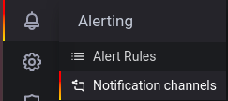
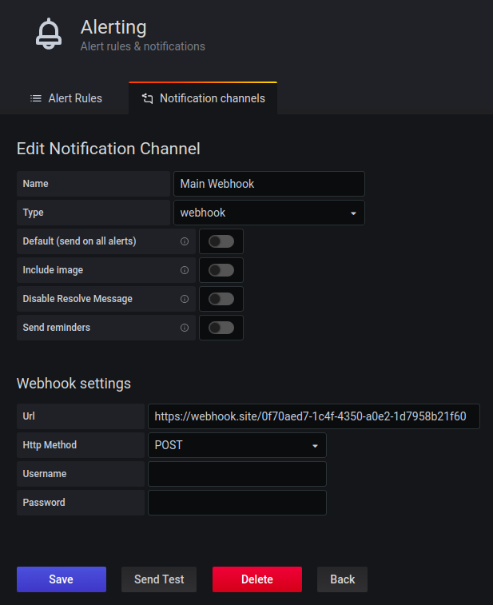

Build your own image
```
docker build --tag adrian3ka/grafana:0.0.1 .
```

OR

```
# Make sure you docker environment clean-up from any container named grafana
docker stop grafana
docker rm grafana


# Run grafana
docker run -d --name=grafana -p 3000:3000 adrian3ka/grafana:0.0.1
```

go open
```
http://localhost:3000
```
and enter username: `admin` with password: `admin`

Get inside docker container:
```
docker exec -it grafana /bin/bash
```

Start the database:
```
service postgresql start
sudo -u postgres psql
ALTER USER postgres with encrypted password 'password';

CREATE DATABASE "grafana-test";

\q
```

Login as username `postgres`:
```
PGPASSWORD=password psql -d grafana-test -h localhost -U postgres
```

Create a new Table and insert some data:
```
CREATE TABLE IF NOT EXISTS public.display_data (
  id SERIAL PRIMARY KEY,
  should_display BOOLEAN NOT NULL,
  value INT NOT NULL,
  updated_at TIMESTAMP WITH TIME ZONE NOT NULL DEFAULT NOW(),
  created_at TIMESTAMP WITH TIME ZONE NOT NULL DEFAULT NOW()
);

INSERT INTO display_data (should_display, value) VALUES 
  (true, 1),
  (false, 2),
  (false, 3),
  (true, 4),
  (true, 150);


SELECT * FROM display_data;
```

Create a new data source on Grafana

put this query after click `Edit SQL` button:
```
SELECT
  $__timeGroupAlias(created_at,$__interval),
  sum(value) AS "value"
FROM display_data
WHERE
  $__timeFilter(created_at)
GROUP BY 1
ORDER BY 1
```

Create a new alert channel for `webhook`, for the receiving client you could use https://webhook.site or any other sites:



and then configure your first channel like this



and you could make some alert to be ringing if the threshold if is greater than 200
